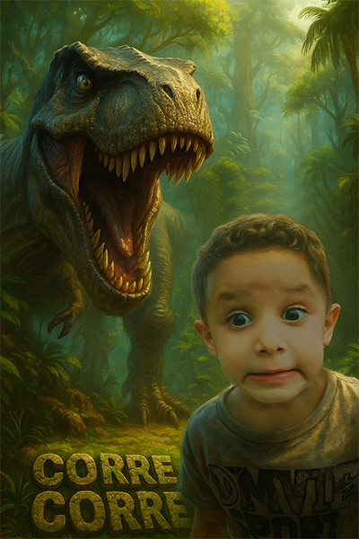
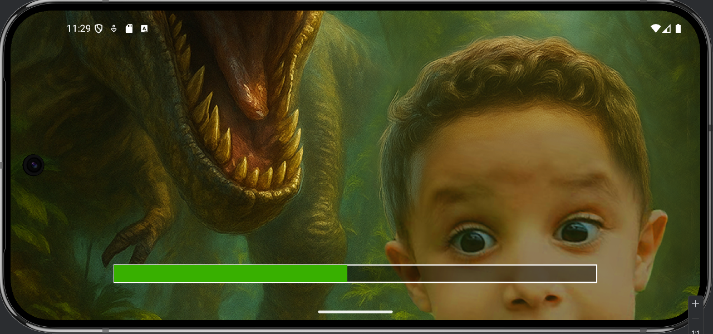
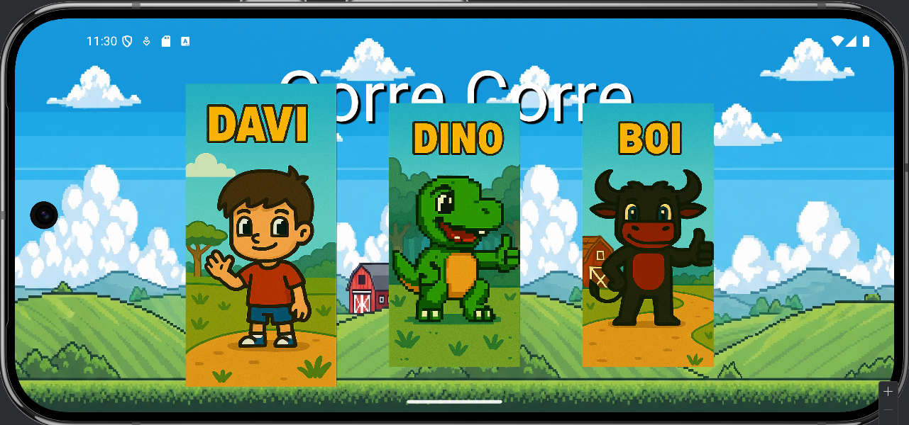
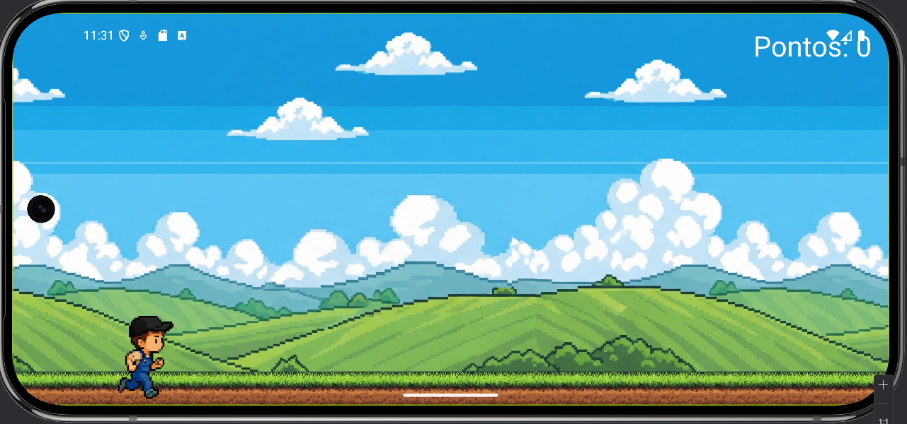
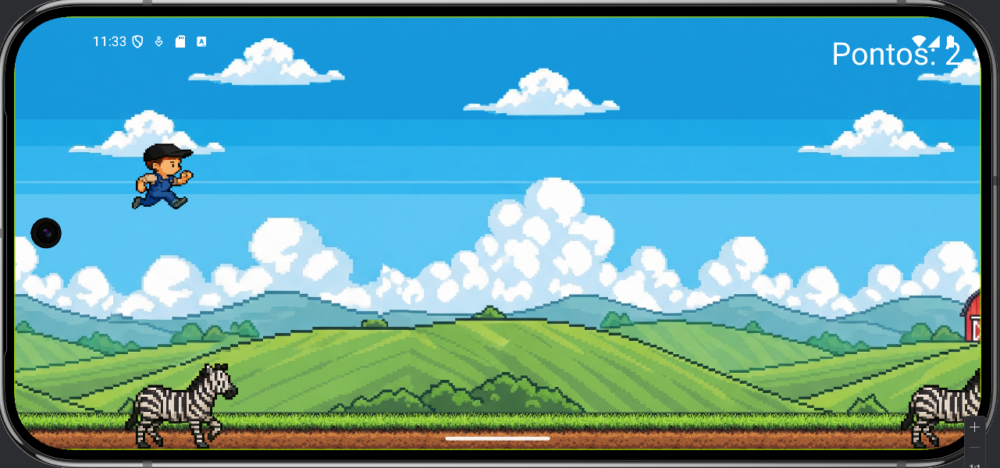
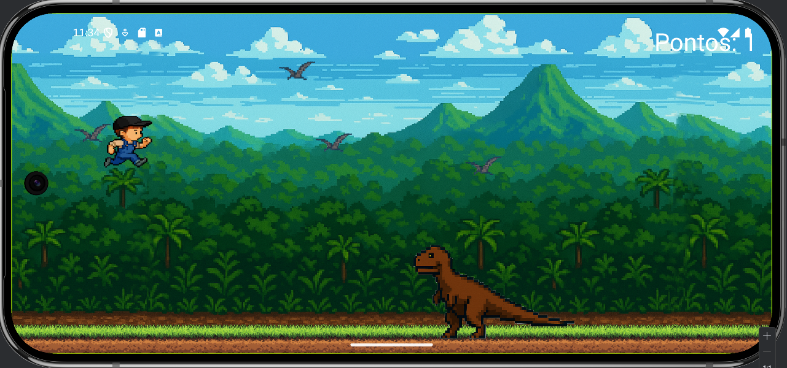
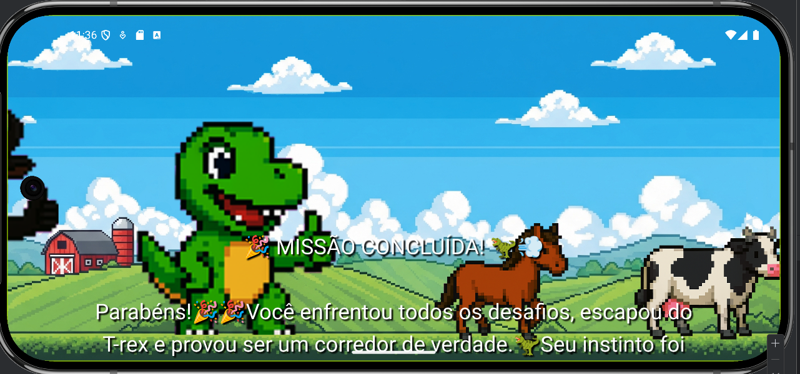

# 🦖 Jogo Corre Corre 💨

### Uma aventura de pai para filho, pixel por pixel.

---

## 🎯 Nossa Missão

Mais do que um simples jogo, **Corre Corre** é uma carta de amor em forma de código. Este projeto nasceu do desejo de um pai de criar algo especial e duradouro para seu filho, Davi. Cada linha de código, cada pixel e cada som foi pensado com carinho, transformando uma paixão por programação em uma homenagem que pode ser jogada.

O intuito é simples: **celebrar a alegria, a aventura e o amor incondicional.**

Desenvolvido em Botelhos-MG, durante o inverno de 2025.

## 📸 Galeria de Telas

Uma viagem visual através da experiência de "Corre Corre":

| Carregamento | Menu Principal | Jogo Começando |
|:---:|:---:|:---:|
|  |  |  |
| *Toda jornada começa com uma preparação.* | *Escolha seu herói para a corrida.* | *A contagem regressiva para a adrenalina!* |

| Ação na Fazenda | Ação Jurássica | Missão Cumprida |
|:---:|:---:|:---:|
|  |  |  |
| *Desviando dos obstáculos do campo.* | *Enfrentando os gigantes do passado.* | *O final de uma jornada especial.* |

## 🏃 Personagens Jogáveis

Escolha seu corredor e prepare-se para a aventura!

* **🤠 Davi:** O herói da nossa história! Corajoso e ágil, pronto para qualquer desafio que apareça pela frente.
* **🦖 Dino:** Um amigo pré-histórico com uma passada pesada e um grande coração. Não se engane com o tamanho, ele é rápido!
* **🐂 Boi:** O corredor mais robusto da fazenda. Com ele, a porteira é pequena para tanta velocidade e força.

## 🌎 As Fases

Viaje por mundos diferentes, cada um com seus próprios desafios:

* **🌳 Nível 1: A Fazenda Maluca**
    * **Cenário:** Uma fazenda ensolarada e cheia de vida.
    * **Desafios:** Desvie de vacas, cavalos e até girafas que resolveram passear por aqui. O cenário é tranquilo, mas os obstáculos são constantes!

* **🌋 Nível 2: A Era dos Dinos**
    * **Cenário:** Uma perigosa e vibrante selva pré-histórica.
    * **Desafios:** Cuidado com os diversos tipos de T-Rex que estão famintos e no seu caminho. Um pulo em falso e você vira almoço!

* **💥 Nível 3: O Caos Total**
    * **Cenário:** A fazenda e o parque dos dinossauros se misturaram em um evento caótico!
    * **Desafios:** O teste final! Enfrente todos os tipos de obstáculos dos mundos anteriores em um desafio de reflexos de tirar o fôlego.

## 🎮 Como Jogar

Os controles são simples e intuitivos:

* **📱 Celular:** Toque em qualquer lugar da tela para pular.
* **⌨️ Teclado:** Pressione `Espaço` ou `Enter` para pular.
* **🕹️ Joystick:** Use o botão de ação (X no PlayStation, A no Xbox) para pular. Use as setas (D-Pad) para selecionar os personagens no menu.

## 🛠️ Tecnologias Utilizadas

Este projeto foi construído com ferramentas modernas e poderosas:

* **[Flutter](https://flutter.dev/):** O framework da Google para criar aplicações lindas e nativamente compiladas para mobile, web e desktop a partir de uma única base de código.
* **[Flame Engine](https://flame-engine.org/):** Um motor de jogos 2D minimalista e modular construído sobre o Flutter, que torna a criação de jogos uma experiência divertida e produtiva.

---

> "Papai te ama, Davi."

* **[DOWNLOAD](https://github.com/davidmp24/jogo_corre_corre/releases/download/v1.0.0-beta/Corre.Corre.apk)
